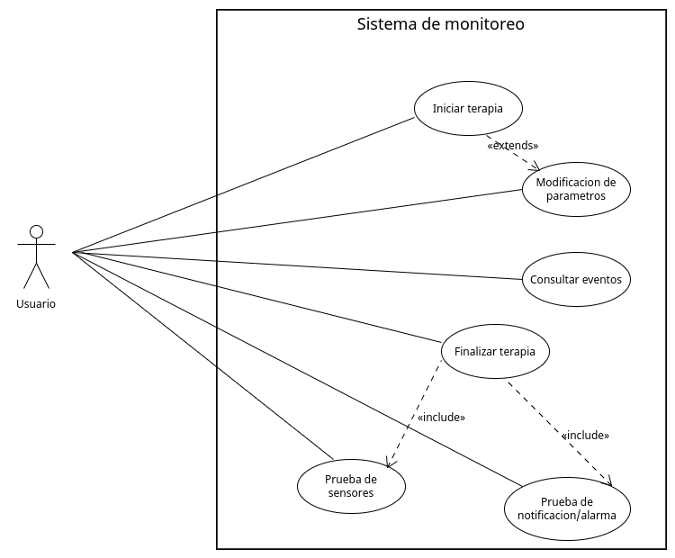
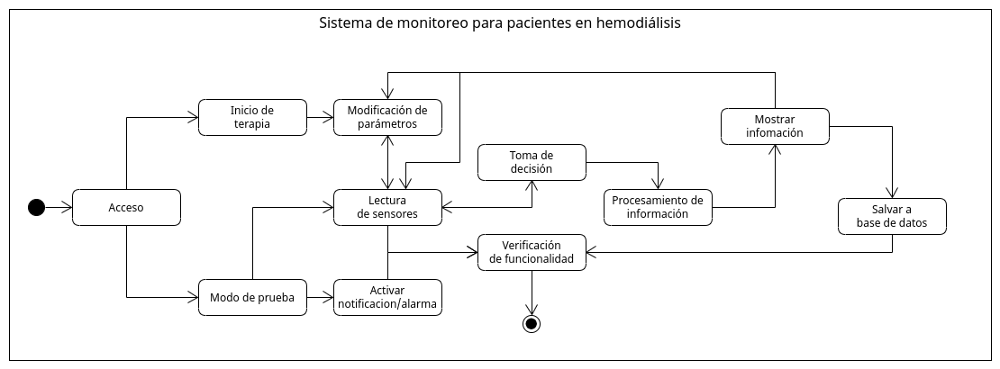
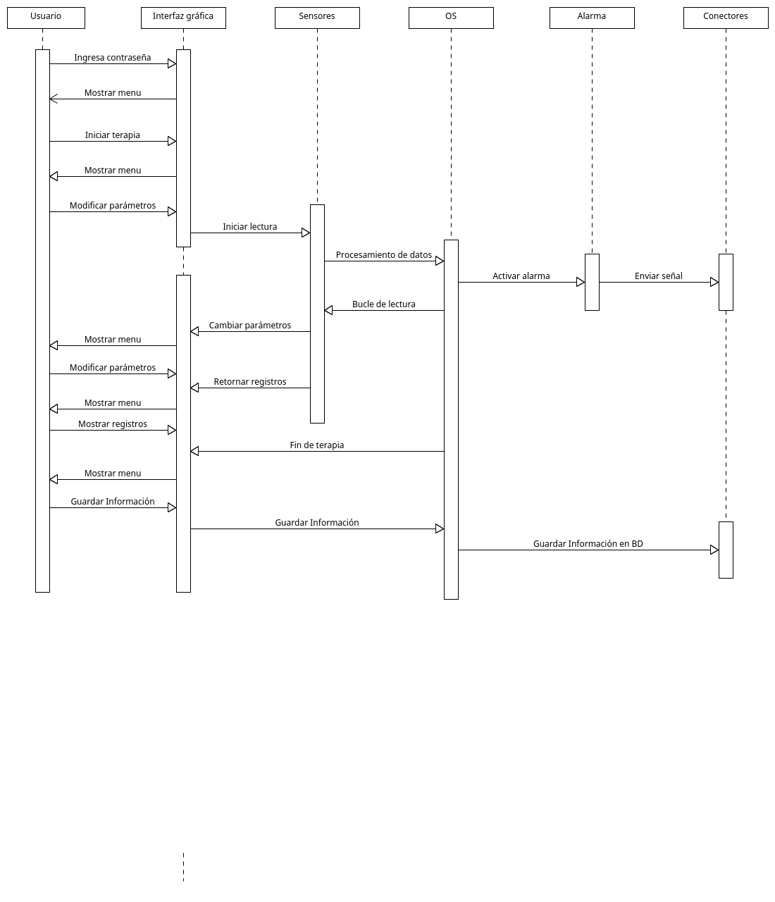
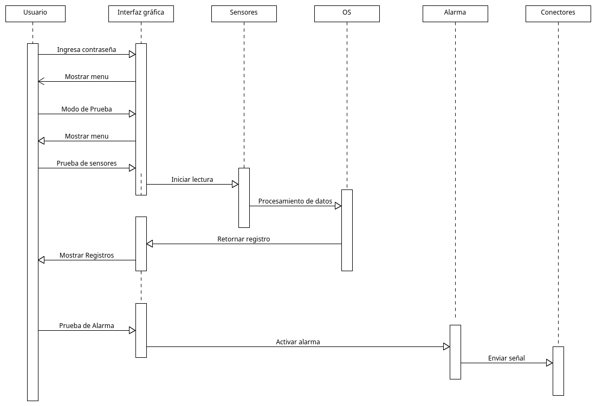
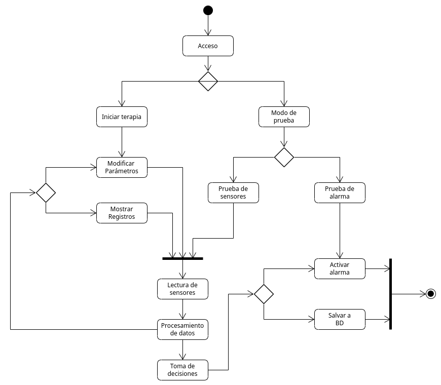

---
title: Sistema de monitoreo para pacientes en hemodiálisis
subtitle: Sistemas de tiempo real
author: Erick Lievana Poy
geometry:
- margin=1in
...

# Introducción

## Antecedentes

En medicina, la hemodiálisis es una terapia de sustitución renal que tiene como finalidad suplir parcialmente la función de los riñones. Consiste en extraer la sangre del organismo con el fin de consiguir la circulación de agua y solutos entre la sangre para, entre otros fines, disminuir los niveles de sustancias tóxicas y exceso de liquidos. 

La hemodiálisis principalmente se realiza en instalaciones hospitalarias o en clínicas ambulatorias, con la presencia de personal sanitario con entrenamiento específico. Aunque es menos frecuente, la diálisis también se puede hacer en casa del paciente como hemodiálisis domiciliaria.

Es un proceso costoso con un rango desde los $3,500.00 hasta los $7,500.00 pesos mexicanos por sesión, las cuales pueden comprender hasta 3 sesiones semanales de por vida. Sumado a esto generalmente es un tratamiento indicado para pacientes con un historial médico complicado. Desde 2010 se habla de una epidemia de insuficiencia renal crónica en México junto con una tasa de mortalidad hasta del 63.4%, esto debido a lo delicado estado de salud del paciente y las complicaciones del tratamiento de hemodiálisis.

## Propósito

El proposito del sistema de monitoreo para pacientes en hemodiálisis tiene como propositos:

1. Ayudar a los médicos que administran este tratamiento a llevar un control preciso del estado de sus pacientes.
2. Reducir la tasa de mortalidad de los pacientes al brindar información mas detallada a los médicos tratando haciendo uso de de bases de datos para formar un registro mas detallado de la evolución del paciente.
3. Reducir los costos del tratamiento, al permitir a los médicos monitorear a mas pacientes al mismo tiempo o facilitando el acceso a hemodiálisis domiciliarias.

## Alcance del proyecto

Se espera que el proyecto se vuelva parte del protocolo de salubridad para todos los servicios de hemodiálisis, esto al desarrollar el proyecto de manera ecónomica con el objetivo de usar al máximo los otros sistemas y recursos que ya utilizados en este procedimiento, reutilizando e interpretando los datos que estos sistemas proveen esto desarrollado bajo una arquitectura que sea de una escalabilidad media, pero adaptable para los distintos tipos de pacientes.

## Métodologia de trabajo

Debido a la naturaleza del proyecto y su área de aplicación se utilizara el método de desarrollo de sistemas dinámicos. Esto por su continua implicación del usuario, en este caso el médico tratante, en un desarrollo iterativo y creciente que se adapte los requerimientos que puedan surgir como cambios globales en los protocolos del tratamiento, necesidades específicas del paciente y adaptabilidad a los sistemas disponibles para las clinicas, hospitales o pacientes.

## Casos de uso

Para nuestro proyecto consideramos al médico o persona que aplica la hemodiálisis como nuestro principal actor/usuario y en muchos de los casos el único actor. En versiones futuras podemos incluir mas actores dentro del sistema dependiendo de las funcionalidades que puedan agregarse al sistema.

### UC-01: Iniciar terapia
* Descripcion: El usuario inicia el sistema de monitoreo con la configuración deseada/requerida
* Prioridad: Alta
* Frecuencia: Siempre
* Actores: Usuario
* Flujo:
    * Inicializar registro de terapia haciendo uso de la interfaz gráfica
    * Permitir al usuario configurar parametros, intervalo de monitoreo, rangos de alarma, duración de terapia, etc.
    * Prueba de notificación/alarma
    * Iniciar monitoreo
* Flujo alterno:
    * Error al configurar los parametros, rangos o datos invalidos. Se mostrara un error indicando el parámetro erroneo.
    * Error al leer sensores, sensor desconectado o faltante. Se mostrara un error indicando el sensor en fallo.
    * Error de respuesta de notificación/alarma. Se mostrara un error indicando que el sistema de notificación/alarma no ha recibido respuesta. 
* Notas:
    * Para la prueba de notificación/alarma, se puede corroborar de forma simple o redundante, la forma simple es pedir que el propio usuario de una señal de respuesta ante la notificación/alarma dentro de un intervalo de tiempo, la forma redundante es que el propio sistema de monitoreo registre y responda a la notificación junto con el usuario.

### UC-02: Modificación de parametros
* Descripcion: El usuario modifica los parametros del sistema.
* Prioridad: Alta
* Frecuencia: Casi siempre
* Actores: Usuario
* Flujo:
    * Entrar a la configuración de la terapia en curso desde la interfaz gráfica
    * La interfaz muestra los parámetros actuales de la terapia en curso
    * El usuario modifica los parámetros deseados
* Flujo alterno:
    * Error al configurar los parametros, rangos o datos invalidos. Se mostrara un error indicando el parámetro erroneo.
* Notas:
    * Es importante que el sistema de monitoreo continue trabajando de manera ininterrumpida aun con el cambio de parametros.

### UC-03: Consultar eventos de terapia 
* Descripcion: El usuario solicita los registros de las lecturas hechas por los sensores o sistemas de la terapia
* Prioridad: Alta
* Frecuencia: Regularmente
* Actores: Usuario
* Flujo:
    * El usuario puede entrar al registro de la terapia en curso con la interfaz gráfica
    * A travez de la interfaz grafica selecciona un intervalo de tiempo dentro de la duración de la terapia
    * El sistema muestra las lecturas realizadas durante ese periodo de tiempo
* Flujo alterno:
    * Error de registro, un registro esta incompleto o faltante. Se mostrara un mensaje de error y se solicitara un chequeo de sensores.
* Notas:
    * Para evitar errores respecto al intervalo de tiempo, se puede mostrar al usuario una lista con los registros disponibles.

### UC-04: Finalizar terapia
* Descripcion: El usuario da por terminada la terapia deteniendo el monitoreo
* Prioridad: Alta
* Frecuencia: Siempre
* Actores: Usuario
* Flujo:
    * El usuario finaliza la terapia a traves de la interfaz gráfica
    * El sistema envia los registros de la terapia a la base de datos
    * El sistema hace una limpieza de memoria y rutina de pruebas
* Flujo alterno:
    * Error al guardar la información a la base de datos. Se mostrara un error y el sistema se pausara hasta que la información haya sido respaldada.
* Notas:
    * En caso de presentar la falla, se dara la opción de reintentar almacenar los registros a la base de datos o descargar la información a un dispositivo de almacenamiento.

### UC-05: Realizar prueba de notificación/alarmas
* Descripcion: El usuario puede comprobar la funcionalidad de las notificaciones/alarmas activandolas.
* Prioridad: Alta
* Frecuencia: Ocasional
* Actores: Usuario
* Flujo:
    * En la interfaz gráfica el ir al apartado de pruebas
    * Seleccionar prueba de notificación/alarmas
* Flujo alterno:
    * Error de respuesta de notificación/alarma. Se mostrara un error indicando que el sistema de notificación/alarma no ha recibido respuesta. 

### UC-06: Realizar prueba de sensores
* Descripcion: El usuario puede comprobar la lectura y monitoreo de los distintos sensores
* Prioridad: Alta
* Frecuencia: Ocasional
* Actores: Usuario
* Flujo:
    * En la interfaz gráfica el ir al apartado de pruebas
    * Seleccionar prueba de sensores
* Flujo alterno:
    * Error al leer sensores, sensor desconectado o faltante. Se mostrara un error indicando el sensor en fallo.

# Requerimientos 

## Requerimientos funcionales

En base a que se desea que este proyecto forme parte del protocolo estandar de hemodiálisis, es necesario que el sistema sea simple en el sentido de que cada hospital y clínica tiene distintos protocolos y sistemas para el manejo de sus pacientes y sus datos, por esta razon este sistema de monitoreo no tiene contemplado la implementación de una base de datos ya que cada hospital o clínica tiene su propio formato, ni la implementación de un sistema de notificación/alarma en específico debido a que el tipo de equipos provistos o disponibles varia en base a los recursos disponibles. Por ello es que el sistema funcionara de la manera mas independiente posible, permitiendo de esta manera que el sistema sea completamente adaptable a la mayoria de los hospitales o clinicas.

Por lo anterior mencionado las funcionalidades del sistema seran:

* Comunicación con los distintos sistemas de monitoreo de signos vitales 
* Comunicación con los distintos sistemas de hemodiálisis
* Guardar temporalmente los datos registrados de los sistemas de monitoreo para crear un historial
* Análizar el historial de datos para detectar tendencias y valores extraños
* En base al análisis de datos tomar decisiones sobre notificaciones/alarmas
* Permitir la realización de pruebas tanto para su configuración inicial asi como su mantenimiento

## Requerimientos no funcionales

Al tratarse de un sistema de tiempo real, ambientado en el uso médico el sistema debe proporcionar

* Usabilidad

    El sistema esta diseñado para ser facil de usar, de forma que el tiempo dedicado a su iniciación supere al tiempo ahorrado en el monitoreo continuo del paciente por parte del médico
* Seguridad

    Es importante que solo personal autorizado pueda modicar los parámetros de funcionamiento del dispositivo, por lo que se le incorporara un sistema de seguridad donde se requiera de una contraseña previamente definida para poder modificar los parámetros
* Desempeño

    El sistema debe funcionar en todo momento y con el menor requerimiento de interacción con el usuario
* Confiabilidad

    El sistema contiene varios mecanismos de verificación y de seguridad redundantes para asegurar su funcionamiento no solo en tiempo si no en precisión de resultados
* Escalabilidad

    Para poder cumplir sus objetivos el sistema debe poder ser manufacturado a un bajo costo y ser compatible con decenas sino cientos de sistemas de monitoreo y hemodiálisis distintos. Ademas de poder ser adaptable a los sistemas de control electronicos de los hospitales y clinicas.

# Diseño

## Hardware

Para cumplir con la escalabilidad desea del sistema se usara:

* Una computadora monoplaca con:
    * Pantalla led tactil para poder interactuar con el sistema
    * Entradas para los distintos sistemas de monitoreo
    * Conexiones Input/Output (usb,hdmi,etc)
    * Dispositivos de conexión para redes (Ethernet/WIFI)
    * Bateria de reserva

## Software

Para mantener un costo bajo, se optara por el uso de programas y dependencias de codigo abierto. Asi mismo para poder realizar multiples tareas de manera eficaz pero manteniendo requerimientos bajos, se optara por usar un lenguaje como C para la implementación de la logica, ademas de que debido al gran tiempo que lleva este lenguaje en el mercado se han desarrollado cientos de librerias que ayudaran tanto a la lectura de datos, la interpretación de datos, asi como poder proporcionar el reporte final en distintos formatos.

* Sistema Operativo: GNU/Linux
* Librerias:
    * [SQLite](https://sqlite.org/index.html)
    * [GMP](https://gmplib.org/)
    * [Liquid-dsp](https://liquidsdr.org/)
    * [GTK](https://www.gtk.org/)
    * [libusb](https://libusb.info/)
    * [libmicrohttpd](https://www.gnu.org/software/libmicrohttpd/)
    * [AppArmor](https://apparmor.net/)

## Tipo de sistema de tiempo real

El sistema es un sistema de tiempo real estricto, ya que es absolutamente necesario que la lectura de datos, su interpretación asi como la decisión de activar la notificación/alarma, sea siempre precisa y dentro del tiempo determinado. Ya que la demora o completa falta de una alarma puede llevar a la perdida de vida del paciente.

## Arquitectura

Debido a que el sistema debe de realizar multiples tareas al mismo tiempo, y no todas estas estan relacionadas se optara por una arquitectura Master-Slave. Este patrón consiste en dos grupos, el primero es llamado el maestro (master) y el otro el grupo de esclavos (slaves). Los esclavos realizan la tarea propuesta por el maestro, computan los resultados y los envían de nuevo a este, quien los presenta, almacena o procesa. Esto se realiza así para tener una parte que autoriza y dirige los cálculos necesarios y otras partes que lo procesan de manera agnóstica a estas decisiones.

* Ventajas
    * Gestión centralizada - Este patrón destaca para el diseño de tareas multi-tarea ya que permite dividir las tareas en diferentes módulos que pueden ser ejecutados de forma independiente.
    * Control - Al partir todas las tareas de un único nodo orquestador, se mantiene mayor control ya que las tareas se ejecutan de manera independiente y reciben el contexto y su procesamiento final de un único punto de la ejecución.
    * Escalabilidad - Al ser todas las tareas ejecutadas independientes las unas de las otras es posible escalar fácilmente el sistema de forma que añadir nuevos nodos esclavos se termine traduciendo en un más que posible aumento del rendimiento.

## Diseño conceptual

El diseño es sencillo, para poder reducir costos, se tratara de construir el sistema con la menor cantidad de elementos, mientras se trata de mantener una compatibilidad alta con los distintos equipos medicos. Como se menciono en el apartado de hardware. El sistema contara con:

* Bateria de respaldo, esto para poder continuar con su funcionamiento aun en el caso de corte de energia.
* Entradas para conectar los distintos dispositivos medicos. se usara por default la entrada mas común con la opción de poder agregar adaptadores externos en caso de necesidad
* Display led, para poder interactuar con el sistema sin la necesidad de otros periféricos
* Conexiones de red, tanto alambricas como inalambricas para poder tener comunicación con sistemas de Bases de Datos, notificaciones y alarmas
* Conexiones I/O, usb, hdmi, etc. esto para poder interactuar con el dispositivo a traves de perifericos

## Diagrama de contexto

El objetivo es que el sistema sea lo mas independiente posible, que pueda adaptarse a cualquiera sea la configuración de la terapia de hemodiálisis. Es por esto que el sistema solo tomara los datos que provienen de los sistemas de monitoreo ya existentes e interpretarlos y toma una decisión sobre si el paciente requiere o no atencion médica durante su tratamiento. Es por esto que el sistema no tiene sensores por si mismo y depende de los sistemas externos ya incorporados.

## Diagrama de estado

El sistema cuenta con pocos estados y esto es por diseño, agregar mas estados requeriria que el sistema tuviera mas poder de procesamiento lo cual aumentaria sus costos ademas de incrementar los posibles puntos de falla, esto ultimo siendo de gran importancia, ya que la falla o demora de cualquiera de estos estados puede ser fatal para el paciente.

## Diagrama de secuencia

El sistema cuenta con 2 modos principales. Su modo de terapia y su modo de prueba, ambos de igual relevancia, ya que es necesario que el sistema siempre funcione de manera correcta y una de las mejores formas de conseguirlo es comprobando sus componentes de manera periodica.

En el primer diagrama de secuencia podemos ver como es el proceso de de una terapia, que retroalimentacion se ofrece al usuario y como este interactua con todo el sistema.

En el segundo diagrama de secuencia podemos ver el proceso sencillo de prueba para poder dar mantenimiento al sistema.

## Diagrama de Actividad

Podemos entender los distintos puntos donde el flujo del sistema se divide y como estos son necesarios en cada paso. Con este grafico podemos ver cuales serian los puntos donde el error humano es mas alto y que puntos requieren seguridad o fiabilidad redundante.

## Medidas de tolerancia a fallos

Dado que el sistema es orientado a un aspecto del área de salud, es necesario que su funcionamiento sea impecable, ya que su falla puede llevar a la perdida de vidas humanas. Como primer punto se debe de reconocer cuales son las posibles fallas que el sistema podrias presentar.

* Hardware
    * Falla de corriente electrica
    * Falla de conectores
    * Falla de componentes
    * Falla de cables
    * Interferencias

* Software
    * Error de lectura
    * Error de interpretación
    * Error de memoria
    * Error de tiempo
    * Error de conexión

Podemos clasificar nuestros fallos en 2 categorias:

* Fallos de frecuencia: permanentes, intermitentes y transitorios
* Fallos de dominio: tiempo y valor

Para poder evitar estos fallos el sistema debe diseñarse teniendo en cuenta:

* Confiabilidad y estabilidad del hardware
* Aislamiento de hardware para evitar interferencia
* Estabilidad del software
* Redundancia de modulos

El asegurar la confiabilidad y estabilidad del hardware, es la parte sencilla de este proceso ya que se puede consultar las distintas fichas técnicas, asi como reseñas de los distintos dispositivos para hacer la elección mas apropiada. Asi mismo el aislamiento del hardware, es algo que ya ha sido puesto a prueba en el pasado y del cual ya se tiene información, por ejemplo en el caso que se decida por una cobertura en impresión 3D, ya hay estudios sobre filamentos y diseños para poder crear un elemento resistente sin aumentar costos.

Para asegurar la estabilidad del software, hacemos uso de nuestra arquitectura de software, de maestro y esclavos, para poder tener una redundancia dinámica a traves de la programación de N-versiones, para procesar los datos recibidos en paralelo y tener redundancia no solo con el tiempo sino con el valor de la entrega

## Algoritmo de planificación

Ya que todos los procesos del sistema son importantes, se ha decidido por implementar el algoritmo de planificación Round Robin esto por que es un método que permite que todos los procesos se dividan el tiempo de procesamiento de manera equitativa y en un orden racional, normalmente comenzando por el primer elemento de la lista hasta llegar al último y empezando de nuevo desde el primer elemento.

Se define un intervalo de tiempo denominado cuanto, cuya duración varía según el sistema. La cola de procesos se estructura como una cola circular. El planificado la recorre asignando un cuanto de tiempo a cada proceso. Asi mismo esta estructura de cola circular permite con facilidad implementar los distintos bucles aprovechando la propia redundancia del algoritmo Round Robin

# Bibliográfia

* Alcalde-Bezhold, G., Alcázar-Arroyo, R., Angoso-de-Guzmán, M., Arenas, M. D., Arias-Guillén, M., Arribas-Cobo, P., ... & Molina, F. T. (2021). Guía de unidades de hemodiálisis 2020. Nefrología, 41, 1-77.
* Tirado-Gómez, L. L., Durán-Arenas, J. L., Rojas-Russell, M. E., Venado-Estrada, A., Pacheco-Domínguez, R. L., & López-Cervantes, M. (2011). Las unidades de hemodiálisis en México: una evaluación de sus características, procesos y resultados. salud pública de méxico, 53(suppl 4), 491-498.
* Moyano, L. J. H. Clase 04: Arquitecturas de Software Embebido.
* Factor, M., Sittig, D. F., Cohn, A. I., Gelernter, D., Miller, P. L., & Rosenbaum, S. H. (1990). A parallel software architecture for building intelligent medical monitors. International journal of clinical monitoring and computing, 7, 117-128.
* Jurik, A. D., & Weaver, A. C. (2008). Remote medical monitoring. Computer, 41(4), 96-99.
